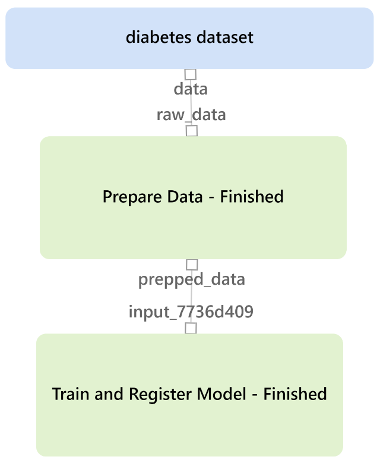

# Azure Machine Learning Python SDK Cheat Sheet

This repository is aggregating main functions, methods and ultimately the setup of the Azure Machine Learning Python SDK.

Azure Machine Learning is a cloud-based service for creating and managing machine learning solutions. It's designed to help data scientists and machine learning engineers leverage their existing data processing and model development skills and frameworks, and scale their workloads to the cloud.

## Overview
Scripts are in order of implementation:
1. Datastores: upload and registration of training data - [./01_datastores.py](./01_datastores.py)
2. Compute: creating compute target for model training - [./02_compute.py](./02_compute.py)
3. Environment: setup of experiment environment and dependencies - [./03_envs.py](./03_envs.py)
4. Pipeline: running experiments divided into pipeline steps - [./04_pipeline.py](./04_pipeline.py)
5. Inference: set up web service and consume for inference [./05_inference.py](./05_inference.py)
6. Batch pipeline and inference: setup pipeline and inference for batch processing [./06_batch_pipeline_inference.py](./06_batch_pipeline_inference.py)
7. Hyperparamenter: tune and evaluate hyperparameter for model performance [./07_hyperparameter.py](./07_hyperparameter.py)
8. Automated ML: run automated Machine Learning experiments for various model testing [08_automatedML.py](./08_automatedML.py)

The main pipeline of 04. itself includes two steps:
* Data preprocessing [./experiments/data_prep.py](./experiments/data_prep.py) inkl. normalization
* Model training [./experiments/train_model.py](./experiments/train_model.py) for classification using logistic regression

For hyperparameter tuning of 07., the model training has been adepted as per [./experiments/parameter_tuning.py](./experiments/parameter_tuning.py).

Finalized Azure Machine Learning pipeline will look like:

## Setup
* Setup Azure ML workspace ([MS ML Quickstart](https://docs.microsoft.com/en-us/azure/machine-learning/quickstart-create-resources))
* Update [./config_template.json](./config_template.json) with your Azure subscription id, resource group and workspace name - **ATTENTION** make sure rename file to `config.json`
* run `conda env create -f environment.yml` for Python environment for local development
* pipeline steps ("experiments") can be found in [./experiments](./experiments)

## Further Notes
Few notes on the SDK libraries:
* azureml-core: Azure Machine Learning Python SDK enabling to write code that uses resources in your Azure Machine Learning workspace
* azureml-mlflow: open source platform for managing machine learning processes which can also be used to track metrics as an alternative to the native log functionality (not used in this repo)

## TODO
* extend azureml function parameter comments
* add part 'differential privacy'
* add part 'interpret models'
* add part 'detect unfairness'
* add part 'data drift'